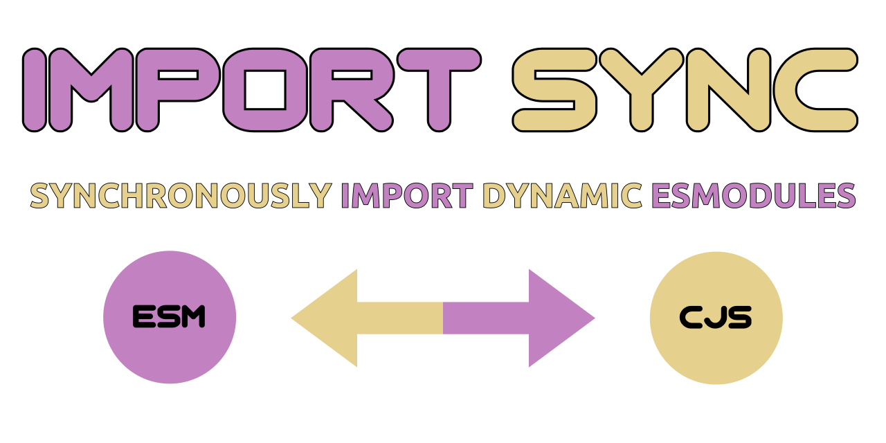

<div align="center">

# [](https://github.com/nktnet1/import-sync)

[](https://github.com/nktnet1/import-sync/actions/workflows/pipeline.yml)
&nbsp;
[](https://codecov.io/gh/nktnet1/import-sync)
&nbsp;
[](https://codeclimate.com/github/nktnet1/import-sync/maintainability)
&nbsp;
[](https://snyk.io/test/github/nktnet1/import-sync)
&nbsp;
[](https://github.com/search?q=repo%3Anktnet1%2Fimport-sync++language%3ATypeScript&type=code)

[](https://www.npmjs.com/package/import-sync?activeTab=versions)
&nbsp;
[](https://packagephobia.com/result?p=import-sync)
&nbsp;
[](https://depfu.com/github/nktnet1/import-sync?project_id=39032)
&nbsp;
[](https://app.fossa.com/projects/git%2Bgithub.com%2Fnktnet1%2Fimport-sync?ref=badge_shield)
&nbsp;
[](https://opensource.org/license/mit/)
&nbsp;
[](https://github.com/nktnet1/import-sync/issues)

[](https://sonarcloud.io/summary/new_code?id=nktnet1_import-sync)
&nbsp;
[](https://app.codacy.com/gh/nktnet1/import-sync/dashboard?utm_source=gh&utm_medium=referral&utm_content=&utm_campaign=Badge_grade)
&nbsp;
[](https://app.deepsource.com/gh/nktnet1/import-sync/)
&nbsp;
[](https://codebeat.co/projects/github-com-nktnet1-import-sync-main)
&nbsp;
[](https://github.com/nktnet1/import-sync/stargazers)

[](https://moiva.io/?npm=import-sync)
&nbsp;
[](https://moiva.io/?npm=import-sync)
&nbsp;
[](https://moiva.io/?npm=import-sync)
&nbsp;
[](https://moiva.io/?npm=import-sync)
&nbsp;
[](https://moiva.io/?npm=import-sync)

---

Synchronously import dynamic ECMAScript Modules similar to CommonJS [require](https://nodejs.org/api/modules.html#requireid)

Basic wrapper around [esm](https://github.com/standard-things/esm) for compatibility with both ESM and CJS projects in NodeJS

Capable of importing ESM-only libraries such as [node-fetch@3](https://github.com/node-fetch/node-fetch#commonjs) in CJS projects

[](https://replit.com/@nktnet1/import-sync-example#index.js)

</div>

---

- [1. Installation](#1-installation)
- [2. Usage](#2-usage)
    - [2.1. id](#21-id)
    - [2.2. options](#22-options)
    - [2.3. return](#23-return)
- [3. License](#3-license)
- [4. Limitations](#4-limitations)
- [5. Caveats](#5-caveats)
    - [5.1. Idea](#51-idea)
    - [5.2. Discovery](#52-approach)
    - [5.3. Result](#53-result)
- [6. Major Changes](#6-major-changes)
    - [6.1. 2023-12-16](#61-2023-12-16)

## 1. Installation

```
npm install import-sync
```

## 2. Usage

Try with [Replit](https://replit.com/@nktnet1/import-sync-example#index.js).

```
importSync(id, options);
```

<details closed>
<summary>Examples (click to view)</summary>

<br/>

Importing from the same directory

```javascript
const { someVariable, someFunction } = importSync('./some-module');
```

Importing `.mjs` file from a different directory

```javascript
const { someFunction  } = importSync('../src/someModule.mjs');
```

Using a different basePath

```javascript
const { someFunction } = importSync(
  './someModule',
  { basePath: process.cwd() }
);
```

Using additional esm options as described in esm's [documentation](https://github.com/standard-things/esm#options)

```javascript
const { someFunction } = importSync(
  './someModule',
  {
    esmOptions: {
      cjs: {
        cache: true
      },
      mode: 'all',
      force: true,
    }
  }
);
```

Importing an ESM-only module

```javascript
const fetch = importSync('node-fetch'),
```

</details>

<br/>

### 2.1. id

Module name or relative path similar to CommonJS [require](https://nodejs.org/api/modules.html#requireid). For example,
- `'../animals/cats.js'`
- `'./dogs.mjs'`
- `'./minimal'`
    -  `importSync` will look for matching extensions in the order `[.js, .mjs, .cjs, .ts]`
- `'node-fetch'`
    - `importSync` can import pure-esm [node-fetch](https://github.com/node-fetch/node-fetch) (v3) into your cjs project

### 2.2. options

<table>
  <tr>
    <th>Option</th>
    <th>Description</th>
    <th>Example</th>
    <th>Default</th>
  </tr>

  <tr>
    <td>basePath</td>
    <td>
      This will only take effect if the given <code>id</code> starts with <code>./</code> or <code>../</code>.
      <br/>
      For example,
      <ul>
        <li>✅ <code>./localLib</code></li>
        <li>✅ <code>../src/localLib</code></li>
      </ul>
      and not
      <ul>
        <li>❌ <code>/home/user/localLib</code></li>
        <li>❌ <code>localLib.mjs</code></li>
        <li>❌ <code>node-fetch</code></li>
      </ul>
      The ❌ examples above will be interpreted as either absolute paths or library imports.
    </td>
    <td>
<pre>
./myModule
</pre>
    </td>
    <td><code>__dirname</code></td>

  <tr>
    <td>esmOptions</td>
    <td>Options for the esm module as described in esm's <a href="https://github.com/standard-things/esm#options">documentation</a>.</td>
    <td>
<pre>
{
  cjs: true,
  mode: 'auto'
}
</pre>
    </td>
    <td><code>undefined</code></td>
  </tr>

</table>

### 2.3. return

The `importSync` function returns the exported module content similar to NodeJS
[require](https://nodejs.org/api/modules.html#requireid).

If an unknown file path is provided a default
[Error](https://developer.mozilla.org/en-US/docs/Web/JavaScript/Reference/Global_Objects/Error/Error)
object is thrown.

## 3. License

<details closed>
<summary>
  Massachusetts Institute of Technology
  (<a href="https://opensource.org/license/mit" target="_blank">MIT</a>)
</summary>

<br/>

```
Copyright (c) 2023 Khiet Tam Nguyen

Permission is hereby granted, free of charge, to any person obtaining a
copy of this software and associated documentation files (the “Software”),
to deal in the Software without restriction, including without limitation
the rights to use, copy, modify, merge, publish, distribute, sublicense,
and/or sell copies of the Software, and to permit persons to whom the
Software is furnished to do so, subject to the following conditions:

The above copyright notice and this permission notice shall be included in
all copies or substantial portions of the Software.

THE SOFTWARE IS PROVIDED “AS IS”, WITHOUT WARRANTY OF ANY KIND, EXPRESS OR
IMPLIED, INCLUDING BUT NOT LIMITED TO THE WARRANTIES OF MERCHANTABILITY,
FITNESS FOR A PARTICULAR PURPOSE AND NONINFRINGEMENT. IN NO EVENT SHALL
THE AUTHORS OR COPYRIGHT HOLDERS BE LIABLE FOR ANY CLAIM, DAMAGES OR OTHER
LIABILITY, WHETHER IN AN ACTION OF CONTRACT, TORT OR OTHERWISE, ARISING
FROM, OUT OF OR IN CONNECTION WITH THE SOFTWARE OR THE USE OR OTHER
DEALINGS IN THE SOFTWARE.
```

[](https://app.fossa.com/projects/git%2Bgithub.com%2Fnktnet1%2Fimport-sync?ref=badge_large)

</details>

## 4. Limitations

There are currently no known limitations.

## 5. Caveats

> Please note that loading [ECMAScript Modules using require()](https://nodejs.org/api/modules.html#loading-ecmascript-modules-using-require) are soon to be supported in NodeJS natively.

### 5.1. Idea

**import-sync** was created to enable the implementation of a global dryrun script that can be run by students undertaking
[COMP1531 Software Engineering Fundamentals](https://webcms3.cse.unsw.edu.au/COMP1531/23T2/outline) in their major group project. This requires the ability to import external ES Modules from any directory or path for use in both CommonJS and ESM-based projects.

The dryrun serves as a sanity check before the
final submission is made, and is located in the centralised [COMP1531 course account](https://taggi.cse.unsw.edu.au/FAQ/Uploading_to_course_accounts/) at the path `~cs1531/bin`. Students who are connected to the CSE lab environment (e.g. via [VLAB](https://taggi.cse.unsw.edu.au/FAQ/VLAB_-_The_technical_details/)) can run the dryrun script from their major project repository, e.g. at the path `~z5313514/comp1531/project-backend`.

### 5.2. Discovery

Initially, the [esm](https://github.com/standard-things/esm) library looked promising. However, when the global dryrun script was executed in a mock student's project directory, the following error occurred:

> Error [ERR_REQUIRE_ESM]: require() of ES Module /import/ravel/5/z5313515/project-backend/src/auth.js not supported.<br/>
Instead change the require of auth.js in null to a dynamic import() which is available in all CommonJS modules

This is due to the `package.json` containing `"type": "module"`, as iteration 1 of the student major project uses ESM for the seamless transition to future iterations.

The following approaches were thus attempted, but were unsatisfactory for our purpose:

1. [jewire](https://github.com/nktnet1/jewire)/[rewire](https://github.com/jhnns/rewire)/[require](https://nodejs.org/api/modules.html#requireid)
    - in iteration 1, the dryrun requires the import of ES6 modules, so [jewire](https://github.com/nktnet1/jewire) (which was used for the dryrun of iteration 0) was no longer satisfying our requirements
    - the same limitations of being CommonJS exclusive applies to [rewire](https://github.com/jhnns/rewire) and [require](https://nodejs.org/api/modules.html#requireid)
2. [import()](https://nodejs.org/api/esm.html#import-expressions) - ECMAScript dynamic import
    - this was the previous attempt at writing the dryrun
    - However, it relied on asynchronous code. Since COMP1531 is **fully synchronous** (including the use of [sync-request-curl](https://github.com/nktnet1/sync-request-curl) for sending HTTP requests), this became a source of mystery and confusion for students
    - additionally, students had to append the suffix `.js` to all of their file imports in the project solely to use the dryrun. This resulted in ambiguous error messages and obscure dryrun requirements unrelated to the project
3. [require-esm-in-cjs](https://github.com/SamGoody/require-esm-in-cjs)
    - this library utilises [deasync](https://github.com/abbr/deasync), which when used in NodeJS for Jest tests, could hang indefinitely as seen in Jest's issue [#9729](https://github.com/jestjs/jest/issues/9729)
    - since COMP1531 uses Jest as the sole testing framework, [deasync](https://github.com/abbr/deasync) was ruled out
4. Other async-to-sync conversions for dynamic [import()](https://nodejs.org/api/esm.html#import-expressions)
    - [synckit](https://github.com/un-ts/synckit): worker_threads, Jest and external imports did not work (unclear reason)
    - [sync-rpc](https://github.com/ForbesLindesay/sync-rpc): leaves orphan processes when used in Jest as explained in issue [#10](https://github.com/ForbesLindesay/sync-rpc/issues/10)
    - [fibers](https://github.com/laverdet/node-fibers): obsolete and does not work for node versions later than 16
    - [synchronize](https://github.com/al6x/synchronize): documentation link gives 404 and has fiber as a dependency
    - [sync/node-sync](https://github.com/ybogdanov/node-sync): uses fiber (note: "redblaze/node-sync" on github, "sync" on npm)

### 5.3. Result

Upon a more thorough investigation into the initial issue with the
[esm](https://github.com/standard-things/esm) module, the cause was the
introduction of the exception starting from NodeJS version 13, as noted in
[@fregante](https://github.com/fregante)'s comment:
- https://github.com/standard-things/esm/issues/855#issuecomment-558319872

Further down the thread was a link to the solution by [@guybedford](https://github.com/guybedford)
- https://github.com/standard-things/esm/issues/868#issuecomment-594480715

which removes the exception through module extension and serves as a satisfactory workaround. This reduced the codebase of **import-sync** to simply a wrapper around [esm](https://github.com/standard-things/esm).

Another issue that **import-sync** (v2) addresses is [esm's open issue #904](https://github.com/standard-things/esm/issues/904), which yields the error message:
> Error [ERR_INVALID_PROTOCOL]: Protocol 'node:' not supported. Expected 'file:'

when importing ESM-only libraries such as [node-fetch@3](https://github.com/node-fetch/node-fetch/blob/8b3320d2a7c07bce4afc6b2bf6c3bbddda85b01f/README.md#commonjs) in a CommonJS module. This is done by overriding the default `Module._resolveFilename` function to remove the `node:` prefix, effectively changing any imports of the form (for example):
```javascript
import http from 'node:http';
```
to
```javascript
import http from 'http';
```
for all imported modules.

For further discussions about this issue, visit:
- https://stackoverflow.com/a/77329422/22324694

---

## 6. Major Changes

### 6.1. 2023-12-16

As of version 2.2.0, **import-sync** has switched from using the archived [esm](https://github.com/standard-things/esm) package to the fork [@httptoolkit/esm](https://github.com/httptoolkit/esm). For further details, please see
- issue [#37](https://github.com/nktnet1/import-sync/issues/37)
- merge request [#38](https://github.com/nktnet1/import-sync/pull/38)

